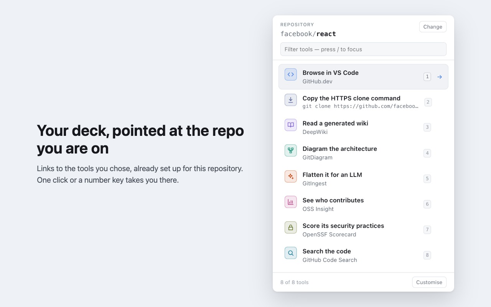

# GitDeck

**You're looking at a GitHub repo. GitDeck connects it to other tools that can open it.**

Click the icon on any repository and get a deck of links to other services — browser IDEs,
architecture diagrams, dependency graphs, AI context exporters — each already pointed at the
repo you're on. One click takes you there.

GitDeck is a connector. The editors, diagrams, wikis and reports are built and run by the
services it links to, not by GitDeck.



## Where it can take you

|                             |                                               |
| --------------------------- | --------------------------------------------- |
| **Open in an editor**       | GitHub.dev, StackBlitz, Codespaces            |
| **Get the code**            | Clone over HTTPS, SSH or `gh`, download a ZIP |
| **Understand the code**     | DeepWiki                                      |
| **Visualise**               | GitDiagram, Git History                       |
| **AI context**              | GitIngest, GitMCP                             |
| **Project insights**        | OSS Insight, Star History                     |
| **Security & dependencies** | deps.dev, OpenSSF Scorecard                   |
| **Search**                  | GitHub Code Search                            |

Each of these is a separate service, run by its own provider. GitDeck isn't affiliated with any
of them and doesn't rebuild what they do. It knows how to point each one at the repo you're
looking at.

## What GitDeck does itself

- Works out which repo (and file) you're on from the address bar
- Builds the right link for each tool, and the clone commands it copies for you
- Keeps your deck: the tools you picked, in your order, with keyboard shortcuts
- Checks every link it offers still responds, weekly, outside the extension

Everything after the click is the other service: what it shows, whether it's accurate, whether
it needs an account, whether it's up. Those questions belong to that service. The ZIP comes
from GitHub, and the clone commands run with your own `git` or `gh`.

## Install

Not in the stores yet. To run it now:

```bash
npm install
npm run dev
```

That opens Chrome with the extension loaded. For Firefox, `npm run dev:firefox`.

## Using it

Click the GitDeck icon on any GitHub repo. Then:

| Key     | Does                         |
| ------- | ---------------------------- |
| `/`     | Jump to the filter box       |
| `↑` `↓` | Move through the deck        |
| `1`–`9` | Open that tool straight away |
| `Enter` | Open the selected tool       |
| `Esc`   | Clear the filter             |

Not on a GitHub page? Paste a repo URL instead.

The deck is yours: it shows only the tools you picked, in your order. **Customise** (bottom right
of the popup) opens a full page with every available tool on one side and your deck on the other.
Drag tools across to add or remove them, and drag within your deck to reorder — the first nine
get the number keys. The same page decides where a tool opens: a new tab, the tab you're already
on, or a background tab so you can fire off several at once. All of it is remembered.

## Privacy

GitDeck asks for two permissions. `activeTab` reads the address of the tab you're on
when you click the icon. `storage` remembers your settings. That's it.

- No tracking, no analytics, no accounts
- No reading your code, your page, or your other tabs
- Nothing is stored except your settings: your deck, where tools open, and whether to offer
  unverified tools. They sit in your browser's sync storage, so browser sync can carry them
  between your devices. No URLs, no history
- The extension itself never makes a network request — the only thing that happens is
  the link you choose to click
- When you open a tool, that service sees which repo you sent it, and its own privacy policy
  applies from there

The full [privacy policy](docs/privacy.md) spells this out.

## Want to add a tool?

It's one entry in one file. See **[Adding a tool](docs/adding-a-tool.md)** — it takes
about five minutes.

## More docs

- **[Architecture](docs/architecture.md)** — how it's built and why
- **[Tools](docs/tools.md)** — what's in the deck, how each was verified, what got rejected
- **[Privacy policy](docs/privacy.md)** — what GitDeck reads, stores and sends
- **[Store listing](docs/store-listing.md)** — the text and justifications given to each store
- **[Roadmap](docs/roadmap.md)** — what's next
- **[Contributing](CONTRIBUTING.md)** — dev setup and house rules

MIT licensed.
